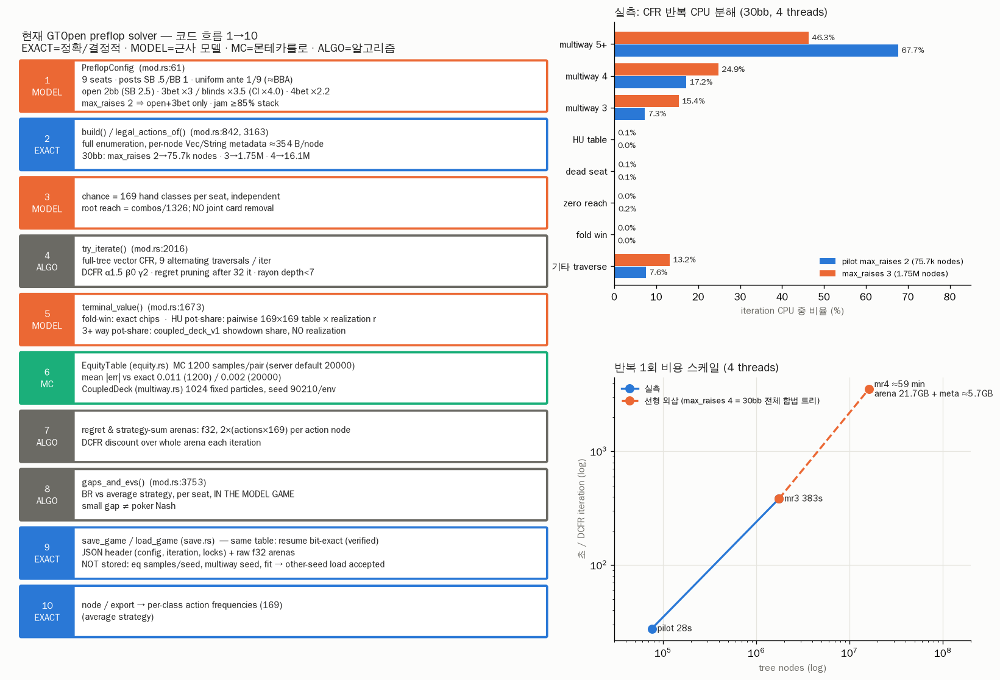

# GTOpen preflop solver — architecture / performance audit v1 (2026-09-28)

- Branch: `claude/gtopen-architecture-perf-audit-20260928`, base `419d61c`
- Scope: audit + benchmark only.
  - Solver numerics are unchanged. Instrumentation sits behind the `t2-profile` feature and is compiled out by default.
  - No 20/25/40bb mass solves were run.
  - Human model code (plan.py / reads / line-plan / replan) was not touched.
- Code: `vendor/gtopen` (upstream MatthewPDingle/GTOpen b69ea07; no LICENSE file, so research use only)
- Figure: [`GTOPEN_ARCH_AUDIT_V1.png`](GTOPEN_ARCH_AUDIT_V1.png)
- Raw measurements: [`data/gtopen_audit/`](../data/gtopen_audit/)
- Reproduction: section 16

---

## 0. Conclusion first

1. **The current pilot does not solve "9-max 30bb preflop".** It solves the following model game:
   - **open + 3bet (or jam) only**: `max_raises=2`, and the open counts as raise 1. Facing a 3bet you can only fold or call; there is no 4bet or 4bet-jam at all.
   - All 3+-way pots are settled at **pure showdown equity**: no realization, no position, no initiative.
   - HU pots are settled as equity × **±8% positional weight** (not constant-sum).
   - Uniform 1/9bb ante.
   - SB opens only to 2.5bb, and there is no limp option.

   Converging fast on this game is not success, and the ">0.15 gap" stop rule measures only this model game's gap.
   - **Why its RFI is tight (§5).** The main cause is the payoff model, not CFR or the equity arithmetic.
     - Realization is hand-independent, so the BB folds **0.000** against CO/BTN opens in every variant tested. Calling beats folding whenever equity ≥ 19.2%, and the worst class (72o) has 28.9%. That caps steal EV.
     - max_raises 2→4 moves late-position RFI by only +0.002–0.03, although it rewrites the 3bet responses.
     - Equity samples and seed move it ≤0.006. The model knobs (positional k, multiway model) move it ≈±0.05.
     - At the pilot's stop point (iteration 40, gap 0.051), early-position RFI is still drifting (UTG 0.105→0.112 by iteration 60). The cheap legacy-model game run to 400 iterations settles by ≈150; at iteration 40 its UTG was 8% below the converged value.
2. **Wall-clock is dominated by multiway terminals (coupled_deck_v1): 92% of pilot CPU and 87% at max_raises=3.**
   - HU table terminals are 0.03–0.07%.
   - Evaluator speed (evaluate7) does not enter the iteration loop at all.
   - **So an Odds-Calculator-style fast evaluator or cache barely changes wall-clock (<0.3%).** Its value is accuracy (an exact HU table).
3. **The real 30bb game (max_raises=4) is 16.1M nodes / 21.7GB arena + ≈5.7GB metadata / ≈59 min per iteration on 4 cores (extrapolated).** This does not run on current CI (16GB, CPU only).
   - The fix is not "cut the strategic options" but:
     - ① chance sampling of multiway terminals (MCCFR-style; the only prototype that measured near-linear gains)
     - ② removal of duplicate/overhead computation where measured (naive SIMD/joint rewrites did NOT beat the current code, §13)
     - ③ arena and metadata compression
4. Checkpoint:
   - **With the same equity table, save→load→continue is bit-identical** to an uninterrupted solve, and also identical at 1 vs 2 threads (verified).
   - But the header does not record the eq seed, samples or multiway seed, so **loading into a table from another seed is accepted silently** (verified). That must be fixed before any DB work.
5. Verdict: **incremental improvement (keeping the CFR core) + targeted redesign (the terminal payoff layer and storage).** A full rewrite is not needed (section 14).

---

## 1. Architecture (actual code path)



Main files:
- `crates/solver/src/preflop/mod.rs` (3,778 lines): config, tree, CFR, terminal, gap
- `preflop/equity.rs`: 169×169 MC pairwise table
- `preflop/multiway.rs`: coupled_deck_v1
- `preflop/save.rs`: .gtop
- `crates/server/src/main.rs`: HTTP API and solve loop
- T2 driver: `tools/run_gtopen_9max_db_pilot.py`

## 2. The game the solver actually solves

| element | current definition (code) | real poker / T2 goal | quality impact |
|---|---|---|---|
| players/positions | 9 seats UTG..BB (`PreflopConfig.positions`) | same | exact |
| blinds/ante | posts SB .5 / BB 1. **Every seat** adds a uniform 1/9bb to invested (`root_state`, mod.rs:3134) | T2 = BB posts a 1bb BBA | limited: dead money is equal, but BB's stack/SPR and "ante counts toward invested" differ |
| action menu | `legal_actions_of` (mod.rs:3165): **all raises including jam** allowed only when `st.raises < max_raises`. Open = raise 1 | open, 3bet, 4bet, 5bet-jam | **pilot max_raises=2 has no 4bet at all**; `fourbet_mults` is dead config |
| sizings | open 2bb (SB 2.5), 3bet ×3.0 IP / blinds ×4.0 in the CI pilot (`run_gtopen_9max_db_pilot.py`) and ×3.5 in this audit's fixtures (`make_configs.py`), 4bet ×2.2. Jam when ≥0.85×stack; `add_allin` always adds jam | public ref: SB open 3–3.5bb | near/limited |
| limp | `cfg.limp` is global only (any first entrant may limp) | SB-only limp | missing; global limp makes the tree explode (§11) |
| chance | independent 169 classes per seat, root reach = combos/1326. **No joint card removal between seats** | 1326 combos, dependent deal | approximate (small in HU, larger in multiway) |
| fold terminal | exact chips (`KIND_FOLD_WIN`) | same | exact |
| HU pot terminal | `pot·Σ_j dist_j·eq(h,j)·r_p`, r = 1+0.16·frac·min(SPR,8)/8 (`realization_weights` mod.rs:812). r_IP≈1.08, r_OOP≈0.92, so the **two shares need not sum to the pot** | postflop subgame EV | model (continuation model = static) |
| HU equity | `EquityTable` MC, 1200 samples/pair (pilot); server default 20000 | exact enumeration | MC error MAE 0.011 / max 0.029 (1200) |
| multiway terminal | `CoupledDeck::equities`: 1024 fixed particles. Per particle, one random representative combo per class + a shared deck; hero equity = E[Π_q(CDF_q(<)+t·CDF_q(=))]. **Opponents independent, identical classes = identical hand (tie), pure showdown share, no realization** | multiway postflop EV | coarse model; the dominant term for pot odds / position |
| balanced realization | uses `cache/realization_fit.json`; **the file is absent in the vendored snapshot**, so it falls back to raw equity (`blend`→relative=eq) | — | "balanced" = no positional weight (raw) |
| rake | 0 (pilot) | tournament 0 | exact |

"Continuation model" = the postflop valuation at each terminal. Every current mode (static / balanced / legacy) is a **heuristic**, not a postflop solve.

## 3. Pipeline audit (stage by stage)

Measurements are 30bb 9-max; mr2 = pilot tree (75,669 nodes); mr3 = max_raises 3 (1.75M nodes); 4 threads.

| # | stage | input → output | data structure | time complexity / measured | memory | approximation | bottleneck / accuracy risk |
|---|---|---|---|---|---|---|---|
| 1 | config | JSON → `PreflopConfig`, `validate` (mod.rs:3015) | serde struct | O(1) | — | uniform ante, one size per level | extra fields/typos are silently ignored (serde default); fourbet_mults is inactive under max_raises=2 |
| 2 | tree | config → `nodes: Vec<PNode>` (`build` mod.rs:844, recursive) | per node `Vec<PAction{kind:String,label:String,..}>`, `invested: Vec<f64>`, `r: Vec<f32>` | O(nodes). mr2 274 ms, mr3 5.0 s (≈2.9 µs/node) | **≈354 B/node** (mr3 peak RSS 591MB, excluding arena) | none (exact enumeration) | metadata heap allocations; mr4 ≈5.7GB metadata |
| 3 | chance/root | class_prob → root reach [n][169] | `Vec<Vec<f32>>` | O(n·169) | small | independent classes, no card removal | multiway blocker effect missing |
| 4 | CFR traversal | node, p, reaches → cfv[169] (`traverse` mod.rs:1818) | recursive, rayon fan-out at depth<7, **new `Vec` per node visit** (reach copies, vals, sigma) | O(n traversals × Σ_action nodes na·169) + terminals. mr2 1.29M action visits / 5 iterations | per-thread stack + temporary Vecs | none (full-width) | allocation overhead ~8–13% (the "other traverse" share) |
| 5 | terminal payoff | reaches → cfv (`terminal_value` mod.rs:1673) | fold O(169); HU O(169²) AVX2; MW O(1024·k·169·Q) scalar f64 | fold 1.5 µs, HU 13 µs, **MW3 1.09 ms / MW4 1.48 ms / MW5+ 2.65 ms per call** | CoupledDeck 1024×169×3×u32 ≈2MB | §2 | **92% of CPU**; recomputed for each traverser (no reuse) |
| 6 | equity | build: `EquityTable::build(samples)` (equity.rs:230) / `CoupledDeck::build` | [169×169] f32 / order, lower, upper | 1.42 s (1200) / 21.2 s (20000); 36 ms | 114KB / 2MB | MC; seed = PREFLOP_EQ_SEED ⊕ pair index | 1200 samples: error 0.011 |
| 7 | regret update | cfv → regrets (+=), strat_sum (+= reach·σ) | flat `f32` arenas, 2×(na·169) per action node | O(arena) | **mr2 102MB, mr3 2.37GB, mr4 21.7GB** | f32 accumulation | memory is the capacity limit |
| 8 | DCFR discount | whole arena ×(t^1.5/(t^1.5+1)), neg ×0.5, sum ×(t/(t+1))^2 (`try_iterate` mod.rs:2015) | same | mr2 14 ms/iteration, mr3 464 ms/iteration | — | none | small (0.05–0.12%) |
| 9 | strategy averaging / pruning | `average_strategy` (mod.rs:1609); regret pruning (warmup 32, refresh every 8) | — | reduces MW calls to ~24% of the theoretical count (mr3, iteration 1) | — | stale strat_sum in pruned subtrees (off-path) | pruning is already a large speed factor |
| 10 | convergence (gap) | avg strategy → per-seat BR gain (`gaps_and_evs` mod.rs:2083 → traverse_checkpoint) | mode 1/2 traversal | **mr2 one check 71.7 s ≈ 2.5 iterations** | temporary | measured only in the model game | at check_every 20: ~13% overhead |
| 11 | save/load | solver → .gtop (JSON header + raw f32) (save.rs:135/192) | file | save 0.78 s / load 0.99 s (102MB) | arena size | — | **eq samples/seed, MW seed, fit hash not recorded** (§10) |
| 12 | export | node → 169×action frequencies (average strategy) | JSON | O(169·na) | — | — | frequencies are class-level; combo-level is impossible |

## 4. Exact vs approximate

- **Exact (deterministic, no error)**
  - tree enumeration
  - fold-win chips
  - DCFR update / discount / average
  - BR gap computation (with respect to the model game)
  - save/load bits (same table)
  - thread-count independence (1 vs 2 threads bit-identical)
- **Monte Carlo (error can shrink as samples grow)**
  - HU EquityTable: MAE 0.0113 at 1200 → 0.0021 at 20000; exact enumeration possible
  - multiway 1024 particles (a fixed set, so the error does not average away: it is a seed-dependent bias)
- **Model approximations (more samples do not remove them)**
  - multiway: independent opponents, pure showdown, no realization
  - HU static ±8% positional weight
  - no card removal
  - uniform ante vs BBA
  - one sizing per level
  - missing SB limp
  - max_raises=2 cutting off 4bets (pilot)

## 5. Structural causes of the tight 30bb RFI — evidence

Figure: [`GTOPEN_RFI_EXPERIMENTS_V1.png`](GTOPEN_RFI_EXPERIMENTS_V1.png). Raw data: `data/gtopen_audit/rfi_experiments.json`.
The public aggregate (PreflopRanges 30bb) is used **only as a sanity marker**: it differs in SB open size (3.5bb), limp, BBA, the 4bet tree and the unknown continuation model. Nothing below is tuned toward it.

### 5.1 Method

- Seeds were fixed in advance (eq and multiway seed 202; one extra seed, 303) and every run is reported whether or not it looks good.
- Every comparison changes **one factor** on the same config, seed and iteration count.
- **X-series (9-max, pilot game mr2)**:
  - X1: base (eq 1200, static), 60 iterations, report every 20.
  - X2: eq 20000.
  - X3: `legacy_product` multiway.
  - X4: `balanced` (which is raw, because the fit file is missing).
  - X2–X4 ran for 40 iterations.
- **Late-position subgame (4-/5-handed, 200 iterations, gap ≤0.0025)**:
  - Because the solver has **no card removal**, the 9-max subgame "UTG..HJ fold → CO" is the same game as a 4-handed CO/BTN/SB/BB table with the same 1bb total dead ante. (The ante is a sunk constant, so who pays it does not change strategies.)
  - X1 confirms it: 9-max iteration 60 CO/BTN/SB = 0.269/0.376/0.602 vs 4-handed mr2 0.271/0.374/0.605.
  - That lets the full legal tree (max_raises 4) and every factor sweep be solved to a gap 20–50× smaller than the pilot, in minutes.
- The audit fixture uses a blind 3bet of ×3.5; the CI pilot uses ×4.0, so CI numbers are not reproduced bit-exactly (X1 at iteration 40 differs from the CI seed-202 run by 0.004–0.014 per position).

### 5.2 Results

**(a) The pilot's stop rule stops before frequencies converge (X1).**

| iteration | gap_total | UTG | UTG+1 | UTG+2 | LJ | HJ | CO | BTN | SB |
|---|---:|---:|---:|---:|---:|---:|---:|---:|---:|
| 20 | 0.241 | 0.101 | 0.114 | 0.136 | 0.166 | 0.185 | 0.253 | 0.376 | 0.609 |
| 40 | 0.051 | 0.105 | 0.122 | 0.147 | 0.170 | 0.211 | 0.264 | 0.376 | 0.601 |
| 60 | 0.020 | 0.112 | 0.126 | 0.150 | 0.172 | 0.216 | 0.269 | 0.376 | 0.602 |

- At iteration 40 the gap is already 3× below the 0.15 target, yet UTG still moves +7% relative (0.105→0.112) and CO +2% by iteration 60.
- Early-position ranges converge slowest: their subtrees are the largest, and per-seat gap does not weight them by how much their frequencies can still move.
- A gap threshold alone does not certify frequencies. A DB record must carry a **frequency drift** check between the last two checkpoints.

**(b) The missing 4bet is *not* the main cause.** Late-position subgame, iteration 200:

| game | nodes | CO | BTN | SB | opener vs BB 3bet (fold/call/4bet/jam) |
|---|---:|---:|---:|---:|---|
| 4-handed max_raises 2 (pilot menu) | 232 | 0.271 | 0.374 | 0.605 | 0 / 1.000 / – / – |
| 4-handed max_raises 3 | 834 | 0.274 | 0.379 | 0.631 | .386 / .407 / .048 / .159 |
| 4-handed max_raises 4 (full legal tree) | 1,811 | 0.274 | 0.376 | 0.631 | .432 / .380 / .001 / .187 |
| 5-handed max_raises 2 | 785 | 0.270 | 0.374 | 0.605 | — |
| 5-handed max_raises 4 | 12,871 | 0.273 | 0.376 | 0.631 | — (HJ 0.221→0.231) |

- Allowing 4bets changes the *response* strategy completely: under mr2 the opener calls 100% of 3bets.
- But it moves RFI by only **+0.003 CO / +0.002 BTN / +0.026 SB / +0.010 HJ**.
- max_raises=2 is a real defect of the pilot game (3bet/4bet nodes are wrong), but it does not explain opens that are too tight.

**(c) The defender never folds — in every variant.** 4-handed max_raises 4, one factor at a time:

| variant | CO | BTN | SB | BB fold vs BTN open | BB fold vs CO open | SB fold vs BTN open |
|---|---:|---:|---:|---:|---:|---:|
| base (static k=0.16, eq 1200, seed 202) | 0.274 | 0.376 | 0.631 | **0.000** | **0.000** | 0.483 |
| realization raw (= k 0 = "balanced" without fit) | 0.261 | 0.361 | 0.684 | 0.000 | 0.000 | 0.492 |
| static k 0.32 (2×) — sensitivity only | 0.287 | 0.405 | 0.610 | 0.000 | 0.000 | 0.456 |
| static k 0.64 (4×) — sensitivity only | 0.312 | 0.424 | 0.495 | 0.000 | 0.000 | 0.441 |
| eq 20000 samples | 0.271 | 0.375 | 0.632 | 0.000 | 0.000 | 0.471 |
| eq/multiway seed 303 | 0.280 | 0.373 | 0.634 | 0.000 | 0.000 | 0.451 |
| multiway `legacy_product` | 0.314 | 0.414 | 0.632 | 0.000 | 0.000 | 0.622 |
| SB open 3.5bb | 0.274 | 0.376 | 0.559 | 0.000 | 0.000 | 0.483 |
| SB 3.5 + limp (global flag) | 0.321 | 0.398 | 1.000 (limp .799) | 0.000 | 0.000 | 0.485 |
| *public aggregate (sanity only)* | *0.375* | *0.487* | *0.894* | | | |

(k=0 and raw produce an identical gap to 1e-16, which confirms the audit hook reproduces the production path. The unmodified build at k=0.16 reproduces the earlier run's gap bit-for-bit.)

Mechanism, from the code (`terminal_value`, `realization_weights`):
- Facing a 2bb BTN open, the BB's call is worth `pot·eq(h,range)·r − 1` relative to folding. With pot 5.5bb and r_OOP≈0.95 at this SPR, calling beats folding whenever eq ≥ 19.2%.
- Measured with the solver's own table (`t2_defend_check`, `data/gtopen_audit/defend_check.json`): the break-even is 19.2% (r_OOP 0.949). The worst class, 72o, has 28.9% against a top-37% range and still 28.0% against a top-25% range. So **fold is dominated by call for every hand** (when SB folds), whatever the positional coefficient.
- The static model's realization depends only on **seat order and SPR, never on the hand**. It has no domination or playability penalty, so trash offsuit hands keep ≈92–100% of their equity.
- With a defender that never folds, stealing earns only the dead money times the SB's fold rate. Openers therefore stay tight.
- The same artifact appears in:
  - SB completing 100% when limp is allowed
  - the pilot's opener calling 100% vs 3bets
  - multiway pots settling at pure showdown equity with no realization at all.

**(d) Size of each factor on late-position RFI (CO/BTN), relative to base:**

| factor | Δ CO | Δ BTN | classification |
|---|---:|---:|---|
| 4bet menu (mr2→mr4) | +0.003 | +0.002 | small; wrong responses, not wrong opens |
| equity samples 1200→20000 | −0.003 | −0.001 | negligible (noise) |
| seed 202→303 | +0.006 | −0.003 | seed variance ≈ ±0.006 — a *different game*, not more iterations |
| positional realization k 0→0.64 | +0.051 | +0.063 | model-dependent; still no BB fold |
| multiway model coupled→legacy | +0.040 | +0.038 | model-dependent (multiway settlement matters) |
| SB open 2.5→3.5, SB limp | SB only (−0.07 / limp 80%); CO/BTN +0.047/+0.022 with global limp | | menu mismatch vs reference |
| **hand-independent continuation value** | — | — | **root cause of zero BB folds; no config knob fixes it** |

**(e) 9-max checks (seed 202, pilot game mr2).** Files: `data/gtopen_audit/runs/`.

| run | iteration | gap | UTG | UTG+1 | UTG+2 | LJ | HJ | CO | BTN | SB | BB fold vs BTN / UTG |
|---|---:|---:|---:|---:|---:|---:|---:|---:|---:|---:|---|
| X1 base (static, eq 1200, coupled) | 40 | 0.051 | 0.105 | 0.122 | 0.147 | 0.170 | 0.211 | 0.264 | 0.376 | 0.601 | 0.001 / 0.025 |
| X2 eq 20000 | 40 | 0.088 | 0.096 | 0.119 | 0.142 | 0.167 | 0.213 | 0.265 | 0.374 | 0.599 | 0.001 / 0.020 |
| X3 multiway legacy_product | 40 | 0.125 | 0.120 | 0.133 | 0.162 | 0.191 | 0.232 | 0.298 | 0.390 | 0.621 | 0.003 / 0.043 |
| X4 balanced (= raw; log: "realization fit unavailable") | 40 | 0.066 | 0.096 | 0.119 | 0.140 | 0.167 | 0.202 | 0.244 | 0.352 | 0.627 | 0.001 / 0.002 |
| X5 legacy_product, run to convergence | 400 | 0.0047 | 0.131 | 0.142 | 0.165 | 0.196 | 0.238 | 0.296 | 0.387 | 0.605 | 0.000 / 0.000 |

What these show:
- **X2 (equity samples):**
  - Every position except UTG is within ±0.005 of X1.
  - UTG moves −0.009, which is the same size as X1's own 40→60 drift (+0.007). At iteration 40 it cannot be told apart from under-convergence.
- **X3 (multiway model):**
  - It moves CO by +0.034 and BTN by +0.014, the same direction as the 4-handed subgame.
  - It is also ≈100× cheaper per iteration: 0.50 s vs ≈51 s. That matches the profile: coupled multiway terminals are the cost.
- **X4 (balanced):** removing the positional weight makes IP openers tighter (CO −0.020, BTN −0.024) and SB looser (+0.026). This also explains why the CI pilot's balanced arm had BTN below static (0.322 vs 0.362).
- **X5 (legacy run to 400 iterations; it is cheap):**
  - Frequencies stabilise by ≈iteration 150: the largest change between checkpoints 50 apart is 0.009 → 0.002 → 0.0016 → … → 0.0003.
  - At iteration 40 (X3), UTG was 0.120 against a converged 0.131 (−8% relative); at iteration 50, CO/BTN/SB were still +0.002/+0.004/+0.012 off.
  - So a "first check with gap < 0.15" stop **biases early-position ranges low and SB high** in this game.
  - Even fully converged, the **BB folds 0.000** against both UTG and BTN opens.

### 5.3 Conclusion

The tight 30bb RFI is mainly a property of the **payoff model**, not of the CFR or the equity arithmetic.

- Terminal pots are valued by hand-independent realization (HU ±8% by seat) and pure showdown share (multiway). Defenders never fold, which caps steal EV.
- max_raises=2 corrupts the 3bet/4bet responses but barely moves opens.
- Equity MC noise and seed are ≤0.006.
- The early-position ranges are additionally under-converged at the pilot's stop point.
- The correct fix is a better continuation model: hand-dependent realization, measured from HU postflop solves or a trusted reference, never tuned to the public RFI. Its uncertainty should be reported as a model-sensitivity band (k=0…0.64 and coupled vs legacy give ≈±0.05 RFI).
- Raising RFI by calibration toward the public numbers is not a fix and is not proposed.

## 6. Measured performance profile

Pilot mr2, 4 threads, eq 1200, first 5 iterations (`t2_profile`, `data/gtopen_audit/prof_mr2.json`):

| item | value |
|---|---|
| equity table build | 1,419 ms |
| coupled deck build | 36 ms |
| tree build | 274 ms (75,669 nodes / 37,328 action) |
| iteration wall | 23.6 / 22.1 / 30.4 / 29.0 / 28.8 s |
| gap check (1 check) | 71.7 s |
| save / load | 784 ms / 990 ms (102.3MB) |
| DCFR discount | 71 ms total over 5 iterations |

Terminal CPU over 5 iterations (thread CPU sum; traverse wall 133.8 s × 4 = 535 s CPU):

| kind | calls | CPU s | µs/call | share of CPU |
|---|---:|---:|---:|---:|
| mw_5plus | 136,677 | 362.1 | 2,649 | 67.7% |
| mw_4way | 62,166 | 91.9 | 1,478 | 17.2% |
| mw_3way | 35,675 | 39.0 | 1,094 | 7.3% |
| hu_static | 10,770 | 0.145 | 13 | 0.03% |
| fold / dead / zero | 1.05M | 1.39 | ~1.3 | 0.26% |
| rest (traverse, alloc, regret) | — | ≈41 | — | ≈7.6% |

mr3 (1 iteration, `prof_mr3.json`):
- 382.6 s per iteration
- MW3/4/5+ = 235 / 380 / 708 s CPU (**86.6%**), HU 1.06 s
- tree build 5.0 s; discount 464 ms

## 7. Top bottlenecks (by measured CPU share)

1. **Multiway terminal `CoupledDeck::equities`**: 87–92%.
   - Per call: 1024 particles × (k CDF prefix sums + 169×k×Q products). Scalar f64, with random-access gathers.
   - **Recomputed for every traverser**: in a 9-traversal iteration, a k-live terminal is evaluated up to k times, each time with a different opponent set.
2. **Tree/arena size**: max_raises 2→3→4 gives ×23→×213 nodes. Per-iteration time grows linearly with nodes (mr2 28 s → mr3 383 s; mr4 extrapolates to ≈59 min). Memory reaches 27GB at mr4.
3. **Gap checks**: each costs ≈2.5 iterations; ~13% overhead at check_every 20.
4. **Per-node heap allocations** (reaches clone, vals Vec, String labels): part of the "rest" 7.6–13%.
5. Equity table build: a one-off 1.4 s (20000 samples: 21 s); cacheable.

## 8. Effect of an Odds-Calculator-style evaluator / cache on wall-clock

- `evaluate7` measured at 10.1M evals/s (single thread).
  - During iterations evaluate7 is **never called**. It runs only during CoupledDeck build (1024×169 evals = 36 ms) and the EquityTable build.
- A HU table lookup (0.145 s / 5 iterations) is already a cache.
- So even with an **infinitely fast evaluator + cache, the wall-clock ceiling is ≈0.3%** (HU + fold) + table build 1.4 s.
- Where it does pay off: **accuracy**, not time.
  - Exact HU table:
    - 815,958 combo pairs × 166 ms (C(48,5) enumeration with evaluate7) = 37.6 h single-thread.
    - With suit isomorphism (~1/12 to 1/16) and an OMPEval / holdem-hand-evaluator-class evaluator (50–100× faster), **it can be built in minutes, one time**.
    - That removes the 1200-sample error (MAE 0.011).
  - For multiway, an evaluator only helps once particles grow (particle build time is 36 ms, so even 8192 particles is 0.3 s).

## 9. OSS evaluator / equity comparison

| candidate | license | algorithm | exact/MC | eval speed (published) | ranges/board | integration cost | Rust | SIMD/GPU |
|---|---|---|---|---|---|---|---|---|
| **holdem-hand-evaluator** (b-inary) | MIT | rank-sum + perfect hash, ~212KB table | evaluator only (equity self-built) | ~1.2G eval/s (claimed, 1 core) | none (hand eval only) | none (Rust crate) | native | table lookup, no SIMD needed |
| **OMPEval** (zekyll) | ISC | 200KB lookup tables + EquityCalculator | exhaustive + MC | 520–775M eval/s (sequential/random) | ranges, board, dead cards, ≤6 players | C++ FFI (cc crate); low cost | no (port possible) | SSE4.1/AVX2, multithread |
| **PH Evaluator** (HenryRLee) | Apache-2.0 | perfect hash (~100KB) | evaluator | hundreds of M/s (C) | none | C FFI or existing Rust port | port exists | — |
| **rs_poker** (elliottneilclark) | Apache-2.0 | bitset evaluator + MC equity | MC | 50M+/s | ranges, MC | none (Rust crate) | native | — |
| PokerStove | BSD-3 | enumeration | exhaustive | slow (old) | ranges, board | C++ | no | — |
| b-inary postflop-solver | **AGPL-3.0** (development suspended 2023-10) | DCFR, isomorphism, i16 compression, bunching | — | — | postflop solver | **reference only; do not import** | — | — |
| TexasSolver | **AGPL-3.0** | CFR postflop | — | — | — | **reference only** | — | — |

Recommendation:
- Exact HU table generation: **holdem-hand-evaluator (MIT)** + in-house enumeration with suit isomorphism. Offline one-off; the solver only reads the table.
- If a multiway / range-vs-range equity oracle is needed, use OMPEval (ISC) as a validation oracle.
- AGPL projects are reference for ideas only (i16 compression, isomorphism); no code imported.

Speed figures are each project's README claims, not reproduced here. Only evaluate7 (10.1M/s) was measured in this environment.

## 10. Checkpoint / resume

Verification (`t2_resume`, 3-handed 30bb max_raises 4, a=20 → spans the PRUNE_WARMUP=32 boundary; `data/gtopen_audit/resume_result.json`):

| test | result |
|---|---|
| 40 straight iterations vs 20 + save/load + 20 | **header and arena bytes identical** (max diff 0.0), gap identical at 0.016333 |
| 1 thread vs 2 threads | identical sha256 |
| checkpoint loaded into an equity table built with another eq seed (777777) | **load accepted with no error**; after 20 more iterations the arena max diff is 0.876 and gap is 0.0239 |

- There is no RNG in the CFR (MC exists only at table build), and pruning is a pure function of the arena and the iteration count. So **same table ⇒ bit-exact resume**.
- **Risk**: the header keys are `config, hero, hero_backup, iteration, multiway_equity_model, point_locks, pre_hero_frozen, seat_frozen, seat_profiles`. There is no eq samples/seed, multiway seed, realization_fit hash, or source commit.
  - A server restart with a different `PREFLOP_EQ_SAMPLES` or seed would silently continue under a different payoff game.

Design (proposal, small change):
1. Add `payoff_provenance` to the header:
   - `{eq_samples, eq_seed, eq_table_sha256, multiway_model, multiway_seed, multiway_samples, deck_sha256, realization, fit_sha256|null, solver_commit}`
2. load: recompute the hashes of the current table/deck and **reject on mismatch** (explicit `--allow-payoff-change` flag, recorded in provenance).
3. Periodic checkpoints:
   - atomic `save_game` (tmp → rename)
   - keep 2 generations every N iterations or T minutes
   - save the gap history into the header too
4. Seed semantics:
   - **Continuing on the same seed = one long solve.**
   - Different seeds = a sample of **different games (payoff variance)**. "20 minutes × 4 seeds" is not an 80-minute solve (the user's principle).
   - Seeds are fixed in advance and recorded whether they complete or not.
5. CI: resume across the 6-hour job limit using checkpoint artifacts.

## 11. Fuller-tree estimates (`estimate_tree` / `count_walk` logic, same enumeration as `build`)

30bb, 9-max, DB pilot sizing (`tools/gtopen_audit/make_configs.py`; arena = regret+sum f32, 8B × na × 169):

| config | nodes | arena | + metadata (354B/node) | 1 iteration (4 cores, linear extrapolation in nodes) |
|---|---:|---:|---:|---:|
| mr2 (pilot) | 75,669 | 102MB | 27MB | **28 s measured** |
| mr3 | 1.75M | 2.37GB | 0.62GB | **383 s measured** |
| mr4 (= mr5: geometry ends at 30bb) | 16.08M | 21.7GB | 5.7GB | ≈59 min |
| mr4 @20bb | 16.08M | 21.7GB | 5.7GB | ≈59 min |
| mr4 @40bb | 30.4M | 41GB | 10.8GB | ≈1.9 h |
| mr4 + 2 open sizes | 32.2M | 43.5GB | 11.4GB | ≈2.0 h |
| mr4 + 2 3bet sizes | 40.4M | 54.6GB | 14.3GB | ≈2.5 h |
| mr4 + 2 4bet sizes | 39.5M | 53.5GB | 14.0GB | ≈2.4 h |
| mr2 + global limp | 1.83M | 2.47GB | 0.65GB | ≈6.7 min |
| mr4 + global limp | 250M | 338GB | 89GB | infeasible |
| SB-only limp (BvB subtree, HU config) | +23 nodes at mr4 (the BvB subtree doubles) | ≈0 | ≈0 | ≈0 |

Notes:
- The extrapolation assumes per-iteration time ∝ nodes; the MW-terminal ratio can shift with the node mix.
- The iterations needed for 30bb mr4 are unmeasured. Assuming 200 iterations (the mr2 X1 drift in §5 suggests more than 40 are needed): **≈200 h on 4 cores**.
- SB-only limp is cheap but requires a **per-seat limp flag code change**. Global limp gives ×15.6 (mr4) and should be avoided.

## 12. MCCFR / subgame solving / continual re-solving applicability

| system | structure | what transfers | applicability to this problem |
|---|---|---|---|
| **Libratus** (HU NL, 2017) | abstract-game MCCFR blueprint → nested **safe subgame solving** for off-tree bets → self-improvement filling in blueprint gaps | ① blueprint = the full preflop tree; ② subgame solving that refines only the needed node sets (e.g. the BvB, 3bet/4bet subtrees) | ② is valid in 2-player zero-sum. In a 9-way preflop, safe subgame guarantees are lost, but for a **3bet pot that became HU after the open (a 2-player subgame)** it can be used as a refinement tool; exploitability guarantees only inside that subgame |
| **DeepStack** (HU NL, 2017) | continual re-solving: own range + opponent CFV vector; depth-limited lookahead + counterfactual value network | the "continuation model" slot at a terminal = CFV network/table | its core is **replacing the terminal payoff (currently heuristic) with a learned or solved value**. Consistent with this audit's conclusion (the terminal model decides accuracy). No DB need for real-time re-solving (offline DB) |
| **Pluribus** (6-max, 2019) | MCCFR (Linear CFR early) blueprint + multiplayer depth-limited search, 4 continuation strategies at the leaves | **① external/chance-sampling MCCFR for multiplayer**; ② leaves hold **multiple continuation strategies** so the opponent's choice is reflected | ① is directly applicable: Pluribus learned its multiplayer blueprint with MCCFR without Nash guarantees and it worked in practice. ② is a template for improving the multiway terminal model |
| **ReBeL** (2020) | public belief state (PBS) + value/policy nets + search, RL self-play | PBS value net = belief-conditioned terminal value | guarantees only in 2-player zero-sum; multiplayer is out of scope. Needs large-scale training/GPU. **Not suitable at this stage** |

Concrete application:
- **Chance-sampled MCCFR at multiway terminals** (candidate H):
  - Each iteration, estimate equity from a random subset of m of the 1024 particles.
  - The payoff is linear in the particle mean, so the **estimate is unbiased and converges to the same 1024-particle game in expectation** (standard chance-sampling MCCFR).
  - m=128 cuts MW cost by 8×. The cost is variance: more iterations and averaging are needed, and the final gap must be measured with full particles.
  - Going further, draw fresh particles each iteration instead of fixed ones. Then the game becomes "the expectation over particles", and the dependence on a fixed seed (bias) also disappears.
- **Subgame refinement**:
  - Fix the blueprint's root-to-open strategy and re-solve, e.g., the "UTG open → BB 3bet → UTG 4bet/jam" subtree with higher-accuracy terminals.
  - In multiplayer this is only a **quality improvement, not a guarantee**; label it `near`/`limited` in the DB.

## 13. Improvement candidates A–O

Speed factors are estimates for iteration wall time, from the measured profile (MW 87–92%); except where marked "measured", no candidate has been implemented. Accuracy impact is relative to the real poker target.

| # | candidate | speed gain | accuracy impact | complexity | memory | risk |
|---|---|---|---|---|---|---|
| A | exact HU equity table (enumeration + isomorphism, offline) | ≈0 (HU <0.3%); removes 1.4 s build | **+** (removes MAE 0.011) | low | same | low |
| B | board-conditioned lookup (flop/turn tables) | 0 for preflop | 0 (no postflop solve) | medium | large | — (unneeded now) |
| C | rank tables / fast evaluator (holdem-hand-evaluator) | ≈0 (evaluator not in loop); makes A cheap | indirect + | low | +212KB | low |
| D | suit isomorphism | needed for A (1/12–1/16 compute); ≈0 for iterations | 0 | low | — | low |
| E | vectorized range matrices (f32 / h-contiguous MW integral; E2 = interleaved prefix sums) | **measured on an idle machine: E 0.50–0.75×, E2 0.74–0.90× (slower)**. The production f64 loop already keeps per-h values in registers; the rewrites add memory traffic (`t2_mw_bench`, `mw_bench_idle.json`) | ≤2e-7 abs | medium | same | medium; needs `perf`-level profiling before any claim |
| F | multiway particle reuse (one joint pass per terminal for all live players, leave-one-out products; requires simultaneous updates) | **measured 0.48–1.34×** (gain only with 9 live players) | ≤2e-7 abs in the kernel; alternating→simultaneous changes the CFR dynamics (unmeasured) | medium | + | medium–high (low payoff for the dynamics change) |
| G | better card removal (combo-level multiway, blocker reflection) | − (more cost) | **+** (multiway accuracy) | high | + | medium |
| H | MCCFR (chance-sampled multiway: m of the 1024 particles per evaluation) | **measured cost ∝ m: with the f32 kernel, m=128 → 3.8–5.7×, m=64 → 7.5–11.4× (idle)**; with the production kernel, 8× at m=128 in the ideal case | 0 in expectation (the payoff is linear in the particle mean); a single draw has MAE 0.013–0.019 at m=128 and must average out over iterations | medium | same | medium (the final gap must use all 1024 particles) |
| I | pruning (already in place; add RBP-style thresholds / partial pruning) | already ~4× (MW calls at 24%); extra ×1.2–2 | stale off-path sums | low–medium | same | low |
| J | remove allocations (reach/val buffer pools, smallvec) | 5–10% | 0 | low | − | low |
| K | arena layout (i16/f16 compression, compact node meta, lazy alloc) | memory 2–4× → **makes mr4 fit in 16GB** (arena 10.9GB + meta ≈0.6GB) | f16/i16 quantization error (postflop engine precedent) | medium | **−50–75%** | medium |
| L | GPU (GTOpen has a CUDA path) | MW is GPU-friendly (large parallel products); potentially large | 0 | high | GPU memory | high (no GPU in CI) |
| M | continuation memoization (terminal output cache keyed by opponent-dist hash) | small (dists change every iteration → low hit rate) | 0 | low | + | low (low value) |
| N | subgame DB (fix blueprint, refine subtrees) | lets only the needed parts go high-resolution | + (locally) | medium–high | — | medium (guarantees only HU) |
| O | continual re-solving (DeepStack/ReBeL-style) | — | + (if a value net exists) | very high | — | high (outside this project's scope) |

Combined (estimate, from the measured prototypes): H at m=128 (≈4–8× on MW, 8× ideal with the production kernel) + J (5–10%) → whole iteration ≈3.5–6×. E/F gave no reliable gain in isolated prototypes and are not counted.
- mr4 30bb: 59 min/iteration → **≈10–17 min/iteration** (4 cores), still ≈35–55 h for 200 iterations. So Phase 1 alone does not make the full 30bb tree CI-friendly; K (memory) plus more cores / checkpoint-resume across jobs (§10) are required, and a proper profiler run (perf/VTune) should precede any further kernel work.
- This must be validated with before/after measurements on the same config.

## 14. Incremental improvement vs redesign

- **Keep (incremental)**:
  - tree enumeration, DCFR core, pruning, save format (+provenance)
  - rayon parallelism
  - existing tests (e.g. multiway.rs `joint_pot_conservation_and_ties`)

  The core is exact, bit-deterministic, and verified to resume bit-exactly.
- **Redesign (limited to the layer)**:
  - ① **terminal payoff layer**: MW is 90% of the cost and the decisive factor for accuracy. Introduce a joint evaluation (F) + sampling (H) + SIMD (E) interface, and in parallel improve the model itself (multiway realization/continuation, G).
  - ② **storage layer**: compact metadata + compressed arenas (K).
  - ③ **action menu**: per-seat limp and a 4bet-level cap instead of `max_raises` (cutting jam by max_raises differs from real poker).
- A full rewrite is not needed:
  - The bottleneck is concentrated in one function (`CoupledDeck::equities`).
  - The CFR framework is correct and stable.
  - A rewrite would lose the existing tests and the deterministic-resume property.

## 15. Phased roadmap (derived from the audit results)

**Phase 0 — make results trustworthy (no numeric change, 1–2 days)**
- 0.1 save header `payoff_provenance` + reject-on-mismatch load (§10)
- 0.2 DB record provenance schema:
  - table size, positions, action history, stack, blind/ante, sizings, algorithm, iterations, gap trajectory, eq/MW model+seed+hash, continuation model, source commit, quality
- 0.3 Replace the pilot's stop rule ("first check with gap<0.15"):
  - Fix the iteration budget in advance.
  - Accept a record only if **max |Δ frequency| < 0.002 between two checkpoints 50 iterations apart** and the gap is below a threshold. X5 reached this at ≈150 iterations.
  - Record the whole drift trajectory, and record failures too.
- 0.4 Build the exact HU table offline (A+C+D) and pin its hash

**Phase 1 — speed (same game, same config before/after; 1–2 weeks)**
- 1.1 H: chance-sampled MW (m=64/128/256, fresh block each evaluation) behind a flag; gap always measured with all 1024 particles. Compare gap and RFI/response frequencies at equal wall-clock vs the exact-particle solver.
- 1.2 J + profiling: buffer pools for per-node Vecs; run `perf`/VTune on the MW kernel (not available in this container) before attempting E/F again — the isolated rewrites (E, E2, F) were measured slower or equal.
- 1.3 F only if 1.2 shows the CDF build dominates; it also requires simultaneous updates (convergence to be compared on the same config).
- 1.4 K: compact node metadata + f16/i16 arenas. Check that mr4 30bb runs on a 16GB runner.
- Pass criteria: on the mr3 30bb fixture, before/after per-iteration time plus **the same RFI/response frequencies (within tolerance)** at a fixed iteration count.

**Phase 2 — fix the game definition (accuracy; ordered by measured impact, §5)**
- 2.1 **Hand-dependent continuation value for HU pots.** This is the root cause of zero BB folds.
  - Per class × position × SPR bucket, measured from HU postflop solves (the vendored postflop engine) or a trusted, licence-clean reference; the fit file the `balanced` mode expects is currently missing.
  - Never fitted to the public RFI.
  - Validate on the 4-handed subgame first (minutes per solve). Pass criterion: BB fold > 0 arises from the model rather than being forced, with the same seed and iterations.
- 2.2 Multiway settlement: extend realization/continuation to 3+-way pots (G; Pluribus-style multiple continuation strategies as reference). Report the coupled vs legacy band (≈±0.04 RFI) until then.
- 2.3 max_raises=4 (the full legal tree), per-seat SB limp, SB open 3/3.5.
- 2.4 BBA as a real posting structure (BB pays 1bb dead ante). Until this lands, keep the uniform ante and mark records near/limited.

**Phase 3 — DB production**
- 20/25/30/40bb (mr4) → 8–15bb push/fold (small tree; exact is feasible) → 50/75/100bb → 150bb+
- Per record: quality tag
  - exact = small-tree push/fold with exact equity
  - near = full tree, uniform ante
  - limited = mr2/model mismatch
  - rejected = unconverged
- Checkpoint resume (§10) to get past CI time limits

**Phase 4 (optional)** — HU subgame refinement (N): 3bet/4bet pots, BvB.

---

## 16. Reproduction / files

```
# build (CARGO_TARGET_DIR is arbitrary)
cd vendor/gtopen
cargo build --release -p solver --features t2-profile --example t2_profile
cargo build --release -p solver --example t2_eval_bench --example t2_resume --example t2_mw_bench --example t2_defend_check
python3 tools/gtopen_audit/make_configs.py <outdir>              # mr2..mr5, sizing and limp variants
T2_ESTIMATE_ONLY=1 target/release/examples/t2_profile cfg.json 1   # tree size
SOLVER_THREADS=4 PREFLOP_EQ_SAMPLES=1200 target/release/examples/t2_profile cfg/mr2.json 5 5 out.gtop
PREFLOP_EQ_SEED=202 PREFLOP_MULTIWAY_SEED=202 SOLVER_THREADS=4 T2_REPORT=1 \
    target/release/examples/t2_profile cfg/mr2.json 60 20        # X1 (RFI drift)
PREFLOP_EQ_SEED=202 PREFLOP_MULTIWAY_SEED=202 SOLVER_THREADS=4 T2_REPORT=1 T2_MW_MODEL=legacy_product \
    target/release/examples/t2_profile cfg/mr2.json 400 50        # X5 (converged legacy game)
SOLVER_THREADS=1 T2_REPORT=1 target/release/examples/t2_profile cfg/sub4_mr4.json 200 20   # 4-handed subgame
T2_REAL_K=0.32 ... (same)                                          # sensitivity only; needs --features t2-profile
target/release/examples/t2_eval_bench
RAYON_NUM_THREADS=1 T2_REPS=10 target/release/examples/t2_mw_bench
PREFLOP_EQ_SEED=202 target/release/examples/t2_defend_check
python3 tools/gtopen_audit/summarize_rfi.py <run dir> --sub <subgame dir> --ref <crosscheck.json> \
    --out-json data/gtopen_audit/rfi_experiments.json --out-png docs/GTOPEN_RFI_EXPERIMENTS_V1.png
PREFLOP_EQ_SEED=202 target/release/examples/t2_resume cfg/resume3.json 20 <dir>
python3 tools/gtopen_audit/draw_arch.py --prof-mr2 ... --prof-mr3 ... --out docs/GTOPEN_ARCH_AUDIT_V1.png
```

Verification of "no numeric change":
- The solver's `--lib` test target does not compile, **already at base 419d61c**: `preflop/contextual.rs:325` includes `research/ignition-reraise/examples.json`, which is not in the vendored snapshot. So the upstream unit tests could not be run.
- Instead:
  - (a) the default build type-checks, and the feature build with all examples compiles;
  - (b) the feature build with the audit hook at its default reproduces a pre-hook 4-handed solve's gap bit-for-bit (0.0009995513607662734), and k=0 reproduces `raw` bit-for-bit;
  - (c) `t2_resume` shows bit-identical save/load/continue.

| file | contents |
|---|---|
| `vendor/gtopen/crates/solver/src/preflop/t2prof.rs` | feature-gated counters (terminal kind calls/ns, traverse/discount wall) |
| `vendor/gtopen/crates/solver/src/preflop/mod.rs` | 3 `#[cfg(feature="t2-profile")]` insertions only (no numeric change) |
| `vendor/gtopen/crates/solver/examples/t2_profile.rs` | stage timings, gap trajectory, RFI/response report |
| `vendor/gtopen/crates/solver/examples/t2_eval_bench.rs` | evaluate7, exact HU cost, MC vs exact |
| `vendor/gtopen/crates/solver/examples/t2_resume.rs` | resume bit-exactness / other-seed load |
| `vendor/gtopen/crates/solver/examples/t2_mw_bench.rs` | isolated multiway-kernel prototypes E/E2/F/H on the production particles |
| `vendor/gtopen/crates/solver/examples/t2_defend_check.rs` | fold-dominance check for BB defense under the static model |
| `tools/gtopen_audit/make_configs.py`, `draw_arch.py` | configs, figure |
| `tools/gtopen_audit/summarize_rfi.py` | X/subgame summary JSON + `GTOPEN_RFI_EXPERIMENTS_V1.png` |
| `data/gtopen_audit/*.json` | profiles, eval bench, resume, tree estimates, `mw_bench_idle.json` (authoritative; `mw_bench_contended.json` was run under load), `defend_check.json`, `rfi_experiments.json` |
| `data/gtopen_audit/runs/` | X1–X5 9-max outputs (+ stderr gap trajectories) |
| `data/gtopen_audit/subgame/` | 4/5-handed max_raises sweep and sensitivity runs |
| `data/gtopen_audit/configs/` | every config used |
